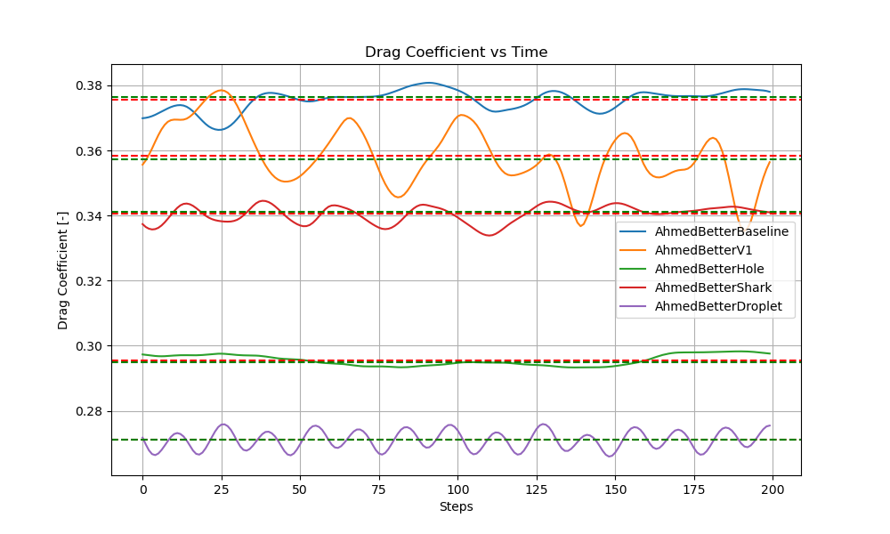

# OpenFoamSim
Author : Denis Fouchard

## Description
This repo hosts the work done on OpenFoam as part of the course *Aerodynamics: an experiment of virtual product development (POLI48)* at Politecnico di Milano.

## Simulations
#### ahmedBody
Simulation of the flow around the Ahmed body with roofbox
#### ahmedBetterV1
First attempt at improving the roofbox geometry \
Credit : Juan Mateos Budiño
#### ahmedBetterHole
Adding a hole in the roofbox \
Credit : Juan Mateos Budiño
#### ahmedBetterShark
Shape the roofbox like a shark fin \
Credit : Juan Mateos Budiño
#### ahmedBetterDroplet
Shape the roofbox like a droplet \
Credit : Paul Archer

## Run the simulation
To run the simulation, you need to have OpenFoam installed on your machine. Then, you can run the following commands in the terminal:
```bash
openfoam
cd ...
./Allrun.sh
```

## Visualization
To visualize the results, you can use the following command:
```bash
touch a.foam
```
Then open the file `a.foam` with ParaView.

## Drag coefficient plot
You can run the simulation yourself and get the `forces.dat` file from `postProcessing/forces/0/forces.dat` to plot the drag coefficient, or use the one provided in the `plotting` folder. The plot is done with Python using `numpy`, `pandas` and `matplotlib`.


## Example Results

Here is an example of the simulation results:



## References
[1] S.R. Ahmed, G. Ramm, Some Salient Features of the Time-Averaged Ground Vehicle Wake, SAE-Paper 840300, 1984. 